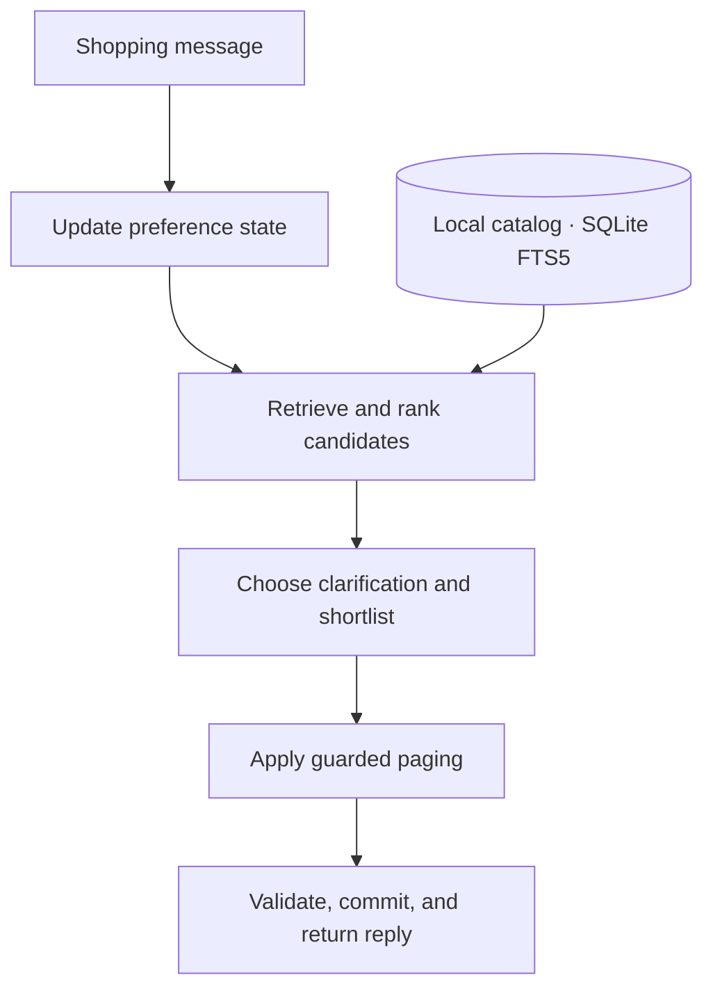

<p align="center">
  
</p>

<h1 align="center">Mercury</h1>

<p align="center">
  <strong>Conversational product search that keeps up with changing intent.</strong><br />
  Search a local catalog, refine your preferences, and explore the next relevant shortlist.
</p>

<p align="center">
  <a href="#getting-started"></a>
  <a href="#technology-stack"></a>
  <a href="#overview"></a>
</p>

<p align="center">
  <a href="#overview">Overview</a> ·
  <a href="#features">Features</a> ·
  <a href="#getting-started">Getting started</a> ·
  <a href="#agent-api">API</a> ·
  <a href="#evaluation">Results</a> ·
  <a href="#development">Development</a>
</p>

---

## Overview

Mercury is a conversational search engine for a local catalog of 50,000 products.
It turns changing shopping requirements into an explicit search state, retrieves
and ranks matching products, and asks focused questions when more information
would help.

A shopper can ask for a black leather bag, switch to blue canvas, then remove the
color preference without losing the requirement for an adjustable strap. When a
shortlist is rejected, Mercury can explore further candidates while preserving
the active requirements and ranking safeguards.

The default pipeline runs entirely on the local machine. It requires no model
weights, embedding download, API key, hosted inference service, or third-party
Python package. This repository provides the search backend, its Python API,
evaluation tools, and a browser-viewable conversation replay.

## Features

| Capability | Behavior |
|---|---|
| **Changing preferences** | Track explicit requirements, corrections, exclusions, alternatives, and no-preference replies across turns. |
| **Multiple retrieval routes** | Combine broad, phrase, category, and exact-constraint searches over a local full-text index. |
| **Constraint-aware ranking** | Use product-field evidence and contradiction guards; missing metadata stays unknown. |
| **Focused clarification** | Select useful facets from the candidate pool and respect questions the shopper has already declined. |
| **Guarded exploration** | Prefer unseen candidates when the search state is stable; reset exposure when requirements change. |
| **Inspectable decisions** | Expose evidence, ranking-stage receipts, paging decisions, and effective runtime capabilities. |
| **Reliable session handling** | Cache exact retries, roll back failed turns, bound session memory, and support explicit cleanup. |

## How it works



Each turn updates a staged copy of the shopper's preferences. Retrieval combines
complementary searches; ranking uses catalog evidence to prioritize candidates
and guard against contradictions. The dialogue policy selects a useful question
and shortlist before paging considers previously shown products.

Only a successful, validated turn commits the new conversation and paging state.
An exact retry returns the stored response, while a failed turn leaves the prior
state available for recovery.

## Technology stack

| Layer | Implementation |
|---|---|
| Runtime | Python 3.10+ and the standard library |
| Search index | SQLite FTS5 |
| Retrieval and ranking | Weighted lexical retrieval, reciprocal-rank fusion, structured constraints, and deterministic ranking policies |
| Conversation state | Explicit evidence records, session-local history, and optional profile memory |
| Demonstration | Static HTML replay, JSON evidence, and a text transcript generated from real agent calls |
| Verification | Standard-library `unittest`, optional Ruff linting, and the unchanged local evaluator |

## Getting started

### Prerequisites

- Python **3.10 or later**, with SQLite **FTS5** enabled.
- The supplied participant catalog archive and its published checksum.
- A shell with `gzip` for the extraction command below.

The recorded release measurement used Python 3.13.5 on macOS. Other deployment
hosts should be checked for SQLite support and resource limits.

### 1. Set up the environment

```bash
git clone https://github.com/dphyy/TechJam_2026.git
cd TechJam_2026

python3 -m venv .venv
source .venv/bin/activate
python -m pip install -r requirements.txt
```

The runtime requirements file intentionally contains no third-party dependencies.
Check that the interpreter supports FTS5:

```bash
python -c "import sqlite3; c = sqlite3.connect(':memory:'); c.execute('CREATE VIRTUAL TABLE probe USING fts5(text)'); c.close()"
```

### 2. Prepare the catalog

Obtain `catalog.jsonl.gz` from the organizer's participant release and place it in
`data/`. Verify the archive against the release checksum before extracting it:

```bash
gzip -dk data/catalog.jsonl.gz
shasum -a 256 data/catalog.jsonl data/public_set.jsonl
```

On Linux, `sha256sum` can be used in place of `shasum -a 256`. The catalog is not
stored in this repository. The 200 public development sessions are included.

<details>
<summary><strong>Expected data checksums</strong></summary>

```text
data/catalog.jsonl — 50,000 products
da979b05a68af864cb0dcf9ee6a81c010c7e66a57978ad286c7a2e005fc69a67

data/public_set.jsonl — 200 development sessions
857259f7a438e6188ac63e18995b6ff4489bfcfc4a716a798b9a2aa0ee8f7579
```

The public sessions cover 80 buying, 80 browsing, 30 intent-override, and 10
boundary scenarios. These are already-used development data, not an untouched
holdout. Keep catalog and evaluator inputs unchanged when reproducing results.

</details>

### 3. Run a conversation

Run this Python example from the repository root after activating the environment:

```python
from agent import Agent

messages = [
    "I'm looking for bags. A key requirement is: black; leather; adjustable strap.",
    "Correction: make that blue and canvas, but keep the adjustable strap.",
    "I have no preference for color. No leather, please.",
    "Those options aren't right.",
]

agent = Agent("data/catalog.jsonl")
try:
    agent.reset("shopping-session", {})
    for turn, message in enumerate(messages, start=1):
        response = agent.respond("shopping-session", message, turn, top_k=10)
        print(response["message"])
        print(response["recommendations"])
finally:
    agent.close()
```

## Agent API

`agent.Agent`, `starter.agent.Agent`, and `mercury.lexical.Agent` export the same
implementation.

| API | Purpose |
|---|---|
| `Agent(catalog_path)` | Load the catalog and initialize search. |
| `reset(session_id, user_profile)` | Start or reset an isolated shopping session. |
| `respond(session_id, user_message, turn, top_k)` | Return a message, clarification attribute, ranked recommendations, and token usage. |
| `last_diagnostics` | Read a detached copy of the latest evidence and execution receipt. |
| `export_profile(profile_id)` | Export a stored profile when one exists. |
| `forget_profile(profile_id)` | Remove stored profile data and associated cached provenance. |
| `close()` | Release resources and clear session, profile, response, and diagnostic state. |

Call `reset` before `respond`. Turn numbers advance from **1 to 10**, and
`top_k` accepts **1–10**. An exact retry of the latest request returns its cached
response without advancing the conversation or paging.

The response has four top-level fields:

| Field | Content |
|---|---|
| `message` | A string containing the agent's reply. |
| `ask_attribute` | A supported clarification attribute, or `null`. |
| `recommendations` | Ordered, unique catalog IDs as `parent_asin`, each with a finite numeric `score`. |
| `usage` | Non-negative `prompt_tokens` and `completion_tokens`; both are zero for the default runtime. |

The agent may return fewer results than requested. Ranking scores are internal
ordering values, not probabilities. Conversation and paging state commit only
after the complete turn succeeds.

## Evaluation

The checked-in release measurement uses the unchanged evaluator and all 200
public development sessions.

| Metric | Recorded result |
|---|---:|
| **Technical score** | **0.967414** |
| **Targets recovered** | **200 / 200** |
| **Hit rate** | **100%** |
| Mean reciprocal rank | 0.965048 |
| Mean turns to completion | 2.105 |
| Median / p95 turn latency | 111 ms / 397 ms |
| Cold start | 9.96 s |
| Model tokens | 0 |
| Agent errors / fallback turns | 0 / 0 |

These measurements were recorded on **31 August 2026**. Exact source,
configuration, catalog, and dataset hashes are retained in
[`docs/current-results.json`](docs/current-results.json). Latencies depend on the
machine and workload. The default has no hosted-model inference charge; local
compute costs are separate.

Reproduce the public score with site-packages disabled:

```bash
python -S -m experiments.submission_evaluate \
  --catalog data/catalog.jsonl \
  --dataset data/public_set.jsonl \
  --output output/public-reproduction
```

Use a **new output directory** for every run. The runner writes
`registration.json`, `report.json`, and `traces.json`, including input/source
hashes, aggregate scores, legality checks, timings, and individual outcomes.

For an uninstrumented run through the official CLI:

```bash
python -m evaluator.local_evaluator \
  --catalog data/catalog.jsonl \
  --dataset data/public_set.jsonl \
  --output output/public-results.json
```

Public scores are development evidence. They do not establish private-test
performance, competition placement, or real-shopper satisfaction.

The score, hit rate, reciprocal rank, and completion-turn count above were
reproduced on **1 September 2026**, with site-packages disabled and network
connections blocked by the evaluation runner. The timing figures remain those
of the recorded release run.

## Demo

Generate a replay from actual calls to the public agent:

```bash
python -m demo.submission --output output/current-demo
```

Open `output/current-demo/index.html` in a browser. The same directory contains
a readable `transcript.txt` and sanitized `evidence.json`. The five-turn replay
shows corrections, preference removal, and exploration after rejected results.
`python -m demo.showcase --output output/current-showcase` is an equivalent CLI.

A verified aggregate score can be attached using `--evaluation-report` and
`--evaluation-sha256`. The demo accepts only a matching source-bound report;
historical or arbitrary scores cannot be attached to a changed implementation.
Generating the demo does not upload or publish anything.

## Development

Verification on **1 September 2026** passed all **1,164 tests**, including the
**130 runtime and integration checks** below, plus Ruff linting. The README's
conversation example was also executed against the supplied catalog.

Run the current runtime and integration regressions without site-packages:

```bash
python -S -m unittest tests.test_lexical_paging tests.test_lexical_state \
  tests.test_guarded_paging_evaluate tests.test_submission_demo \
  tests.test_submission_evaluate
```

Install the optional lint tool:

```bash
python -m pip install -r requirements-dev.txt
python -m ruff check .
```

The complete suite includes historical research pipelines and their optional
dependencies:

```bash
python -m pip install -r requirements-research.txt
python -m unittest discover -s tests -q
```

The research dependency pins describe a previously tested environment; they are
not a guarantee that every Python/platform combination can install the same
optional packages. No research dependency is needed to use the default agent.

### Project structure

| Location | Role |
|---|---|
| `agent.py`, `starter/agent.py` | Public entry points |
| `mercury/lexical/` | Current state parser, retrieval, ranking, clarification, paging, and diagnostics |
| `demo/` | Conversation replay and evidence rendering |
| `experiments/submission_evaluate.py` | Source-bound public evaluation |
| `experiments/guarded_paging_evaluate.py` | Explicit paging-on/off comparison |
| `evaluator/`, `baselines/` | Local scoring harness and baseline |
| `data/` | Public sessions and authored fixtures; catalog supplied separately |
| `tests/` | Runtime, integration, failure-path, and research regressions |
| `assets/` | Application branding |
| `configs/`, other `mercury/` modules | Optional or historical research implementations |
| `docs/` | Machine-readable results and the protocol/status files needed by evaluation tooling |

### Configuration and research tools

The public default is defined by
[`DEFAULT_AGENT_CONFIG`](mercury/lexical/config.py): lexical retrieval, adaptive
shortlists, tentative ambiguity handling, and guarded paging.

`configs/selected.json` belongs to the **former neural pipeline**. Editing it
does not change the public agent. Optional models and historical experiments
require their matching source revision, assets, and recorded environment;
they are not part of the default execution path.

The retained Markdown protocols are evaluator inputs or references emitted by
experiment tooling. They are kept to preserve reproducibility, alongside
[`docs/DATASET_STATUS.md`](docs/DATASET_STATUS.md). Historical reports remain in
Git history rather than as duplicate setup guides.

## Operational limits

- **Language and catalog:** English rule-based interpretation can miss unfamiliar
  taxonomy, complex negation, or implicit requirements. Incomplete catalog
  metadata cannot establish that a product satisfies a constraint.
- **Paging:** Exposure can reset after a correction or changed ranking; an
  exhausted compatible pool can repeat products. Paging does not guarantee
  permanently unique recommendations or repair the catalog.
- **Concurrency:** Calls to one agent instance require external serialization.
  This repository does not expose a production HTTP service.
- **State and privacy:** Session state is held locally in memory and bounded to
  256 sessions by default. Cross-session profile memory is opt-in. Use
  `forget_profile` and `close` for explicit cleanup.
- **Evaluation:** Previously evaluated data remain development evidence, even if
  an old filename says “sealed” or “unseen.” New generalization claims need
  independent evaluation.
- **Deployment:** Verify target-host CPU, memory, startup, and per-turn limits
  before deployment. Installing optional dependencies may need network access;
  running the default search pipeline does not.

Next priorities are broader language and taxonomy coverage, independent shopper
studies, and deployment-host validation.

## Data attribution and use

The competition data are derived from **Amazon Reviews 2023**, published by
McAuley Lab at UCSD. The original data project is
[amazon-reviews-2023.github.io](https://amazon-reviews-2023.github.io/).

The selected category is `Clothing_Shoes_and_Jewelry`; products are joined by
`parent_asin`. The participant data contain text and structured product
metadata, not source images, videos, account credentials, private organizer
labels, or private holdout sessions.

Follow the source dataset's applicable terms and use the data only for the
competition, research, or other permitted purposes. The competition organizer
does not claim ownership of the underlying review or product content. Keep
catalog archives, raw evaluation traces, model assets, secrets, and private
datasets out of source control.

## Team

<table>
  <tr>
    <td align="center">
      <a href="https://github.com/SaaiAravindhRaja">
        <br />
        <sub><b>Saai Aravindh Raja</b></sub>
      </a>
    </td>
    <td align="center">
      <a href="https://github.com/dphyy">
        <br />
        <sub><b>Danvern</b></sub>
      </a>
    </td>
    <td align="center">
      <a href="https://github.com/BrandonChongWenJun">
        <br />
        <sub><b>Brandon</b></sub>
      </a>
    </td>
    <td align="center">
      <a href="https://github.com/Zhikai-Koh">
        <br />
        <sub><b>Zhi Kai</b></sub>
      </a>
    </td>
    <td align="center">
      <a href="https://github.com/kingoldwang">
        <br />
        <sub><b>Kingold</b></sub>
      </a>
    </td>
  </tr>
</table>
