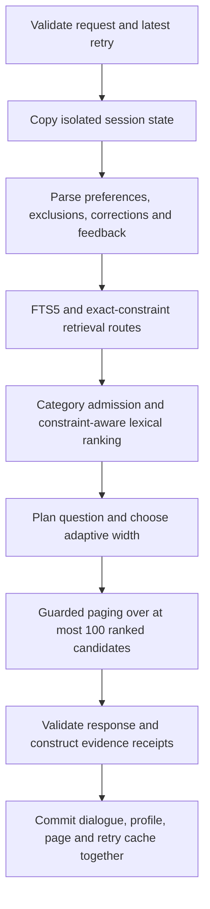

# Current design: lexical search with guarded paging

The public entry is `agent.Agent`, re-exported by `starter.agent` and
`mercury.lexical`. Its configuration is `DEFAULT_AGENT_CONFIG` in
`mercury/lexical/config.py`: lexical retrieval, adaptive shortlist, tentative
recommendation on ambiguity, guarded paging enabled, vector reranking disabled.
No JSON research configuration or neural model is loaded by the default.

## Flow and invariants

A failed turn leaves committed state and exposure unchanged. An identical retry
of the latest request returns a detached copy of the cached response and does
not search or page again. Conflicting/stale retries fail. Reset, profile deletion,
LRU eviction, and close clear corresponding paging state. Sessions are bounded
(default 256); a session accepts at most ten turns and ten returned IDs per turn.
The object is synchronous and requires caller serialization for concurrent use.

Category admission precedes exact-feature tiers. Taxonomy normalization handles
singular/plural forms and removes the combined `Clothing, Shoes & Jewelry`
root without treating every product as a shoe. Free-form modifiers not in the
catalog taxonomy vocabulary are not mandatory category nodes. Missing taxonomy
stays unknown; known incompatible categories cannot pad the slate. A narrow
replacement-strap/handle title guard prevents obvious accessories filed under
bags from satisfying a whole-bag request. This is not a universal product ontology.

Within admitted candidates, known contradictions are demoted ahead of lexical
constraint tiers. Exact hard constraints, category specificity, contiguous
catalog evidence, field/quality tiebreaks and the lexical score determine order.
The score is a ranking heuristic, not a calibrated probability. Missing price or
ambiguous metadata does not establish compliance. Known-violation flags are
conservative parser outputs, not guarantees about real products; the system
currently demotes rather than universally suppresses all contradictory records.

The planner considers facet information, answerability, repeat counts, and
explicit no-preference responses. Every route to the open `other` question
respects refusal and its repeat cap. Empty results produce an honest no-match
message. No clarification is asked on turn ten. Shortlist width is independent
of the paging selector and never exceeds the caller's requested maximum.

## Paging contract

`mercury/lexical/paging.py` owns the pure selector and semantic/override guards.
The production agent stages its result inside the response transaction. Research
adapters import the same selector and explicitly disable paging in their base
agent, preventing a second hidden paging pass.

- First turn, changed active semantics, or an explicit correction: clear exposure
  and return the newly ranked base slate. Even a same-value explicit override resets.
- Same semantics and same top-ten membership: fill the current width from the
  highest-ranked unseen records in the same known-violation tiers as the base slate.
- Changed top-ten membership: return the base ranking and retain exposure history.
- Exhausted compatible tier: fill from ranked seen records; never add a violation
  merely to get novelty. An empty base stays empty.

Rejection-only paraphrases do not enter preference evidence, so they no longer
cause spurious semantic resets. Mixed rejection plus a new need correctly changes
semantics and may reset. Paging is not a blacklist or a guarantee of no repeats.
At most 100 unique exposures are stored per session. Diagnostics report trigger,
reset, base and returned IDs, seen/new counts, exhaustion reason and invariants.

## Evidence and optional research

Receipts distinguish retrieval union, question context, ranked prefix, adaptive
base slate and actual paged output. Constraint checks refer to actual returned
products. Identity includes catalog, source and effective configuration hashes.
The demo rejects unrelated metrics and displays paging receipts.

`FULL_WIDTH_CONFIG` disables paging and adaptation for a raw-prefix control.
`AgentConfig` also supports explicit experimental choices; bare `AgentConfig()`
is an unpaged research configuration, while `Agent()` uses the selected default.
The optional vector reranker is never activated implicitly. Legacy neural/fusion
agents remain available under their original research modules and configurations;
see [research index](RESEARCH_INDEX.md). Their results are not current-release scores.

Remaining limits include finite English parsing, incomplete taxonomy, catalog
contradictions, ambiguous siblings, and no real-user or organizer-private
validation. No runtime logic reads dataset labels or targets. The consumed
robustness-v1 final set was not used to tune this cleanup.
